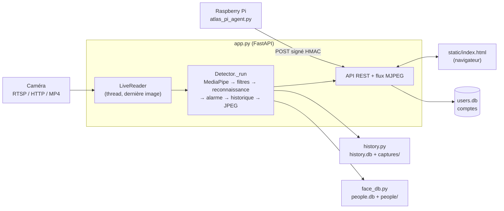
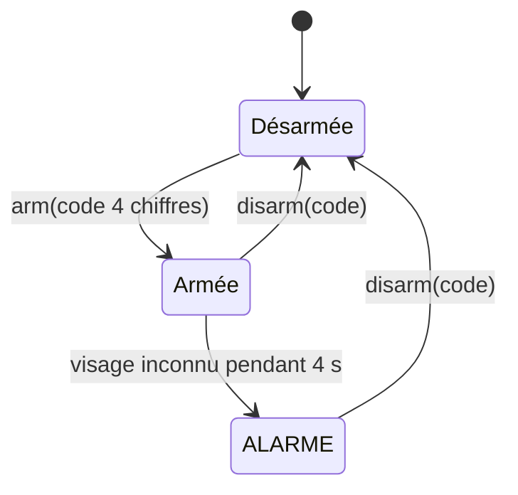

# ATLAS — Documentation technique

Détection de visages en temps réel sur un flux vidéo, reconnaissance des personnes connues, alarme à code et historique. Backend Python (FastAPI), interface web vanilla JS.

## 1. Vue d'ensemble

| Fichier | Rôle |
|---|---|
| `app.py` | API, authentification, boucle de détection, alarme, notifications, métriques système |
| `face_db.py` | Base de visages connus + reconnaissance (embeddings) |
| `history.py` | Historique des passages (SQLite + photos) |
| `atlas_pi_agent.py` | Agent autonome qui envoie les métriques du Raspberry Pi |
| `seed_demo.py` | Crée/synchronise les comptes depuis `.env` |
| `static/index.html` | Interface (SPA) |

## 2. Pipeline de détection (`Detector._run`)

Un seul thread d'analyse, lancé par `POST /api/start` ou `/api/upload`.

1. **Ouverture** du flux (`open_capture`) : essaie `CAP_ANY` puis `CAP_FFMPEG`. En cas d'échec ou de coupure, **reconnexion automatique** toutes les 2 s.
2. **Lecture** : pour un flux, `LiveReader` lit en continu dans un thread et ne garde que **la dernière image** (pas de retard accumulé). Pour un fichier, lecture à la cadence normale, avec pause/seek.
3. **Réduction** de l'image à 960 px de large max.
4. **Détection** de visages avec MediaPipe BlazeFace (`models/blaze_face_short_range.tflite`, téléchargé au premier lancement).
5. **Filtres anti-faux positifs** : score ≥ 0.75, largeur ≥ 4 % de l'image, **3 images consécutives** avec détection.
6. **Reconnaissance** (si `face_db` dispo) : au plus 1 fois / 2 s, sur le meilleur visage uniquement.
7. **Alarme** (voir §3).
8. **Annotation** (cadre rouge « Humain », vert + nom si reconnu), encodage JPEG, publication pour le flux MJPEG.
9. **Historique** (voir §4).

Constantes en tête de `app.py` : `MIN_SCORE`, `MIN_FACE_RATIO`, `CONFIRM_FRAMES`, `MAX_WIDTH`, `HOLD_SECONDS` (1 s, maintien de l'état « détecté »), `EPISODE_GAP` (3 s, fin d'un passage).

## 3. Alarme

- Le code (4 chiffres) est choisi à l'armement, gardé **en mémoire** uniquement, comparé en temps constant (`hmac.compare_digest`).
- Armée + visage **inconnu** détecté en continu 4 s -> `alarm = True` et notification (`notify`) envoyée dans un thread à part.
- Personne **reconnue** → le compte à rebours est annulé (pas d'alarme).
- Une alarme active ne s'arrête que par `disarm` avec le bon code.
- `GET /api/status` expose `armed`, `alarm` et `countdown` (secondes restantes).
- **Notifications** : ntfy (`NTFY_TOPIC`) et/ou email SMTP (`SMTP_HOST`, `ALERT_EMAIL_TO`…), avec la photo en pièce jointe.

## 4. Historique (`history.py`)

Un **événement = un passage** : créé au premier visage validé, mis à jour tant que la personne est là, clos après 3 s sans visage.

- Table `events` (SQLite) : début/fin, source, nombre de visages, score, alarme active, personne reconnue, boîte du visage, noms des photos.
- Deux photos par passage dans `data/captures/` : image complète + visage rogné. La **meilleure prise** (score le plus haut) remplace la précédente.
- Limite `HISTORY_MAX = 2000` : les plus anciens événements et leurs photos sont purgés.
- Fournit liste filtrée (date, alarmes seules), statistiques (total, aujourd'hui, 24 h, histogramme horaire) et export CSV.
- Un seul `threading.Lock` protège la connexion SQLite partagée.

## 5. Reconnaissance faciale (`face_db.py`)

- Modèle **InceptionResnetV1** (facenet-pytorch, poids `vggface2`) → embedding de 512 valeurs, chargé à la demande.
- Comparaison par **distance cosinus** ; match si distance ≤ `FACE_RECOGNITION_THRESHOLD` (défaut `0.5`, plus bas = plus strict).
- Embeddings stockés en JSON dans `data/people.db`, mis en cache mémoire (invalidé à chaque ajout/suppression).
- Si `torch`/`facenet-pytorch` sont absents : `available = False`, la détection fonctionne mais personne n'est reconnu.
- Debug : `FACE_RECOGNITION_DEBUG=1` affiche les distances.

## 6. Authentification et sécurité

- **Comptes** dans `data/users.db`, deux rôles : `admin` et `user`. Créés/synchronisés au démarrage depuis `.env`.
- **Mots de passe** : PBKDF2-SHA256, 200 000 itérations, sel aléatoire.
- **Session** : cookie `argus_session` = `utilisateur:horodatage:signature HMAC-SHA256`, `httponly`, `samesite=lax`, durée 24 h (`APP_SESSION_TTL_SECONDS`), `secure` si `APP_SECURE_COOKIES=1`.
- **Anti brute-force** : 5 échecs par couple IP+utilisateur → blocage 5 min (compteur en mémoire).
- **Middlewares** : en-têtes de sécurité (CSP, X-Frame-Options…) ; authentification obligatoire sur `/api/*`, `/`, `/captures`, `/people-photos` (sauf `/login`, `/api/login`, `/api/system/agent`, `/static`).
- **Droits admin** : gérer les personnes, supprimer l'historique. La suppression est de plus **refusée si l'alarme est armée**.

## 7. API

| Route | Accès | Description |
|---|---|---|
| `POST /api/login` · `/api/logout` | public / connecté | Connexion / déconnexion |
| `GET /api/me` | connecté | Utilisateur et rôle |
| `POST /api/start` `{url}` | connecté | Démarre l'analyse d'un flux |
| `POST /api/upload` | connecté | Envoie et analyse un fichier vidéo |
| `POST /api/stop` · `pause` · `resume` · `seek` | connecté | Contrôle de la lecture |
| `GET /api/status` | connecté | État (détection, alarme, compte à rebours…) |
| `GET /api/video` | connecté | Flux MJPEG annoté |
| `POST /api/alarm/arm` · `disarm` `{code}` | connecté | Armer / désarmer |
| `GET /api/events` | connecté | Historique (`limit`, `offset`, `alarm`, `since`, `until`) |
| `GET /api/events/stats` · `export.csv` | connecté | Statistiques / export |
| `DELETE /api/events[/{id}]` | admin | Supprimer l'historique |
| `GET/POST/DELETE /api/people` | admin | Gérer les visages connus |
| `GET /api/system/stats` | connecté | CPU, RAM, température, disque |
| `POST /api/system/agent` | signature HMAC | Réception des métriques du Pi |

## 8. Métriques système et agent Raspberry Pi

- `GET /api/system/stats` renvoie les métriques de l'agent s'il a émis il y a moins de **20 s** (`source: raspberry_pi`), sinon les métriques **locales** via `psutil` (`source: local`).
- **Agent** (`atlas_pi_agent.py`, stdlib seule) : lit `/proc` et `/sys/class/thermal`, envoie un relevé JSON toutes les **5 s**.
- **Signature** : `HMAC-SHA256(ATLAS_AGENT_TOKEN, timestamp + "\n" + corps)` dans `X-Atlas-Signature`, avec `X-Atlas-Timestamp`. Le jeton ne transite jamais.
- **Protections côté serveur** : jeton obligatoire (sinon 503), corps ≤ 4 Ko, horodatage à ± 120 s, validation Pydantic, refus d'un relevé plus ancien que le dernier reçu (rejeu).
- Déploiement du service : voir `README.md` (systemd, `/etc/atlas-agent.env`).

## 9. Déploiement

- **Local** : `uvicorn app:app --reload` → port 8000.
- **Docker Compose** : `backend` (FastAPI, non publié) + `frontend` (nginx, port **8080**) qui sert `index.html` et proxifie `/api/` et `/captures/` vers le backend. Volumes : `data`, `uploads`, `models`.

## 10. Données et configuration

| Chemin | Contenu |
|---|---|
| `data/users.db` | Comptes |
| `data/history.db` + `data/captures/` | Événements + photos |
| `data/people.db` + `data/people/` | Visages connus + photos |
| `uploads/` | Vidéos envoyées |

Variables `.env` : voir `README.md` (identifiants, `APP_SESSION_SECRET`, `ATLAS_AGENT_TOKEN`, `NTFY_*`, `SMTP_*`, `FACE_RECOGNITION_THRESHOLD`).

## 11. Limites connues

- **Un seul flux** analysé à la fois ; état (alarme, code, tentatives de login, dernier relevé du Pi) **en mémoire** : perdu au redémarrage, non partagé entre plusieurs workers.
- **Dockerfile.backend** ne copie que `app.py` et `history.py` : `face_db.py` doit y être ajouté pour que l'image démarre.
- Valeurs par défaut des mots de passe et du secret de session **à changer** en production.
- Le détecteur trouve des **visages** ; un humain de dos ou sans visage visible n'est pas détecté.
